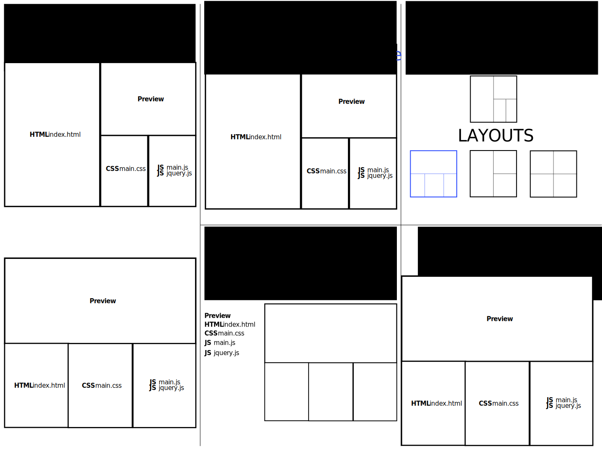

# Clean Tile
**Clean Tile** is a flexible tiling layout system, written for [Polymer][].

## Guide
*This is not extensive documentation.  See [COMING SOON] for the full documentation.*

Most of the examples in this guide will demonstrate Clean Tile being used for a text editor.  Fictitious elements like
`<file-editor>` are used as filler content.

### cleantile-pane

:soon: This element is partially finished, and will be included in the next release.

`<cleantile-pane>` is one of the essential items for Clean Tile.  A pane defines a space where dynamic application
content can be inserted.  Inserted application contents are called **views**.

Clean Tile is designed with tabs in mind.  If you are using tabs, you can insert multiple **views** into a single pane.

```html
<cleantile-pane>
  <file-editor file="README.md" syntax="markdown"></file-editor>
  <file-editor file="LICENSE" syntax="text"></file-editor>
</cleantile-pane>
```

To disable tab-like behavior, the `singular` attribute will enforce that only one **view** is inserted into a pane.

```html
<cleantile-pane singular>
  <file-editor file="README.md" syntax="markdown"></file-editor>
</cleantile-pane>
```

### cleantile-split

:soon: This element is planned for the next release.

`<cleantile-split>` allows dividing a container into two sections, in either a `vertical` or `horizontal` direction.
Each side of the split needs to be either a `cleantile-pane` or a nested `cleantile-split`.

```html
<cleantile-split direction="horizontal">
  <!-- The left side is a pane that only contains a file browser -->
  <cleantile-pane singular>
    <file-browser directory="/home/"></file-browser>
  </cleantile-pane>
  <!-- The right side is split vertically into two panes, each containing text editors -->
  <cleantile-split direction="vertical">
    <!-- The right-top pane contains a single file editor -->
    <cleantile-pane>
      <file-editor file="README.md" syntax="markdown"></file-editor>
    </cleantile-pane>
    <!-- The right-bottom pane contains two file editors -->
    <cleantile-pane>
      <file-editor file="LICENSE" syntax="text"></file-editor>
      <file-editor file="AUTHORS" syntax="text"></file-editor>
    </cleantile-pane>
  </cleantile-split>
</cleantile-split>
```

### cleantile-container

:soon: This element is partially finished, and will be included in the next release.

Splits can be collapsed, and panes can be split.  `<cleantile-container>` provides a consistent shell wrapping panes
and splits.

```html
<body>
  <cleantile-container id="tiling">
    <cleantile-pane>
      <!-- ... -->
    </cleantile-pane>
  </cleantile-container>
</body>
```

Panes and splits expect to be wrapped in a container.  All interactive features will require that content is enclosed
inside a `<cleantile-container>`.

### cleantile-tabs

:memo: This element will be included in a future release.

`<cleantile-split>` can contain multiple views, but doesn't display views that are not currently active.
`<cleantile-tabs>` adds an automatically-created tab bar, with room for additional buttons and layout controls.

```html
<cleantile-pane>
  <cleantile-tabs></cleantile-tabs>
  <file-editor file="README.md" syntax="markdown"></file-editor>
  <file-editor file="LICENSE" syntax="text"></file-editor>
</cleantile-pane>
```

### cleantile-rearrange

:memo: This element will be included in a future release.

Splits can be manually resized, created, and deleted, but that can be tedious when trying to rearrange many views at
once.  A proposed overlay would allow manipulating the layout at a higher level.  A mockup is below.



[Polymer]: https://www.polymer-project.org/1.0/
