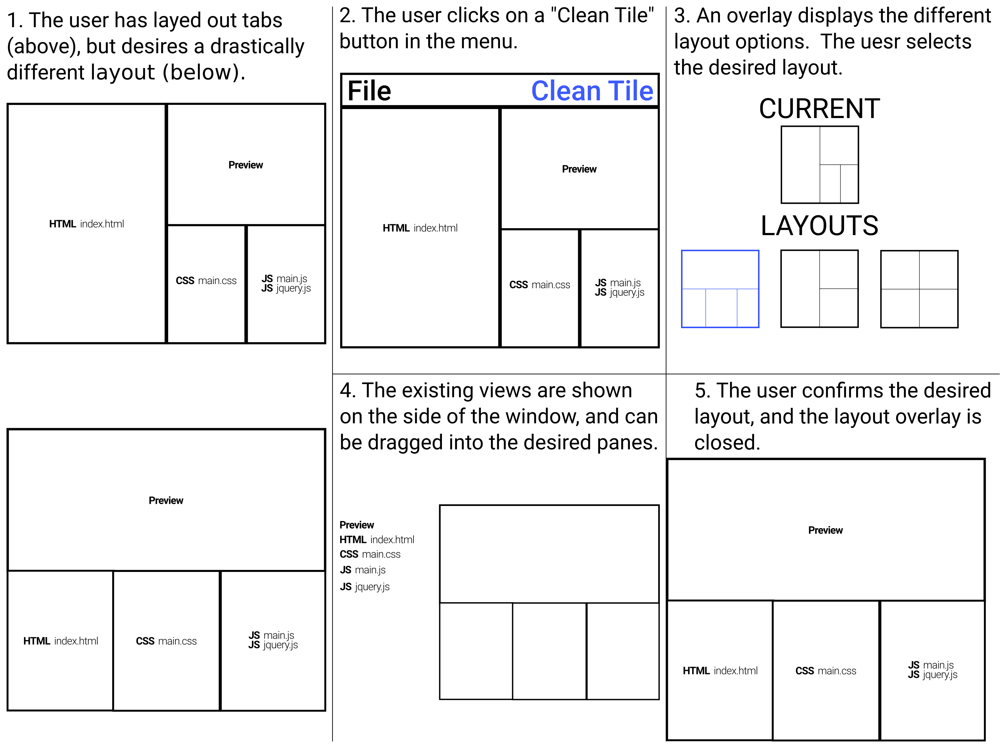

# Clean Tile
**Clean Tile** is a flexible tiling layout system, written for [Polymer][].

[](https://www.npmjs.com/package/cleantile)

[](https://travis-ci.org/cleantile/cleantile)
[](https://saucelabs.com/u/cleantile-tags)

Master: 
[](https://saucelabs.com/u/cleantile-master)

### Screenshot

![Screenshot][simple-binding-screenshot]

See the [documentation][cleantile.codelenny.com] for demos.

## Installation

Clean Tile is cross-published on [NPM][] and [Bower][].

As the Bower `polymer` package is named `@polymer/polymer` on NPM, either a symlink or [Vulcanize][] redirect is needed
to make `node_modules/polymer` point to `node_modules/@polymer/polymer` for all NPM installs.

```sh
npm install --save cleantile
cat node_modules/cleantile/pane/cleantile-pane.html # (same location as source repository)
cat node_modules/cleantile/cleantile-pane.html # (shortcut)
```

```sh
bower install --save cleantile
cat bower_components/cleantile/pane/cleantile-pane.html # (same location as source repository)
cat bower_components/cleantile/cleantile-pane.html # (shortcut)
```

### Components

To provide lightweight downloads, each element is published separately on NPM and Bower.

```sh
npm install --save @cleantile/pane
cat node_modules/@cleantile/pane/cleantile-pane.html
```

```sh
bower install cleantile/pane
cat bower_components/cleantile-pane/cleantile-pane.html
```

Component | NPM | Bower
--------- | --- | -----
container | [![npm:cleantile/container.svg][]][npm:cleantile/container] | `cleantile/container`
pane | [![npm:cleantile/pane.svg][]][npm:cleantile/pane] | `cleantile/pane`
split | [![npm:cleantile/split.svg][]][npm:cleantile/split] | `cleantile/split`
tab | [![npm:cleantile/tab.svg][]][npm:cleantile/tab] | `cleantile/tab`
tabs | [![npm:cleantile/tabs.svg][]][npm:cleantile/tabs] | `cleantile/tabs`


## Guide
*This is not extensive documentation.  See [cleantile.codelenny.com][] for the full documentation.*

Most of the examples in this guide will demonstrate Clean Tile being used in an integrated development environment.
Fictitious elements such as `<file-editor>` are used as filler content.

### Elements

#### cleantile-pane

:new: Added in v0.1.0.

[`<cleantile-pane>`][] is one of the essential items for Clean Tile.  A pane defines a space where dynamic application
content can be inserted.  Inserted application contents are called **views**.

Clean Tile is designed with tabs in mind.  If you are using tabs, you can insert multiple **views** into a single pane.

```html
<cleantile-pane>
  <file-editor file="README.md" syntax="markdown"></file-editor>
  <file-editor file="LICENSE" syntax="text"></file-editor>
</cleantile-pane>
```

To disable tab-like behavior, the `singular` attribute will enforce that only one view is inserted into a pane.

```html
<cleantile-pane singular>
  <file-editor file="README.md" syntax="markdown"></file-editor>
</cleantile-pane>
```

#### cleantile-split

:new: Added in v0.1.0.

`<cleantile-split>` allows dividing a container into two sections, in either a `vertical` or `horizontal` direction.
Each side of the split needs to be either a `cleantile-pane` or a nested `cleantile-split`.

```html
<cleantile-split direction="horizontal">
  <!-- The left side is a pane that only contains a file browser -->
  <cleantile-pane singular>
    <file-browser directory="/home/"></file-browser>
  </cleantile-pane>
  <!-- The right side is split vertically into two panes, each containing text editors -->
  <cleantile-split direction="vertical">
    <!-- The right-top pane contains a single file editor -->
    <cleantile-pane>
      <file-editor file="README.md" syntax="markdown"></file-editor>
    </cleantile-pane>
    <!-- The right-bottom pane contains two file editors -->
    <cleantile-pane>
      <file-editor file="LICENSE" syntax="text"></file-editor>
      <file-editor file="AUTHORS" syntax="text"></file-editor>
    </cleantile-pane>
  </cleantile-split>
</cleantile-split>
```

#### cleantile-container

:new: Added in v0.1.0.

Splits can be collapsed, and panes can be split.  `<cleantile-container>` provides a consistent shell wrapping panes
and splits.

```html
<body>
  <cleantile-container id="tiling">
    <cleantile-pane>
      <!-- ... -->
    </cleantile-pane>
  </cleantile-container>
</body>
```

Panes and splits expect to be wrapped in a container.  All interactive features will require that content is enclosed
inside a `<cleantile-container>`.

#### cleantile-tabs

:new: Added in v0.1.0.

`<cleantile-tabs>` adds an automatically generated tab bar to `<cleantile-pane>` elements, allowing the user to switch
between the views inside a pane.

:memo: In a later release, `<cleantile-tabs>` will support additional buttons and layout controls.

```html
<cleantile-pane>
  <cleantile-tabs></cleantile-tabs>
  <file-editor file="README.md" syntax="markdown"></file-editor>
  <file-editor file="LICENSE" syntax="text"></file-editor>
</cleantile-pane>
```

### Views

As mentioned above, **views** are application-specific elements that are inserted into Clean Tile layout elements.

Clean Tile imposes an API on elements used as view elements to pass information between the application and the layout.

Views are given attributes, including if they are currently active.  They are also sent events when a split changes the
size of the pane, and when they are moved between different panes.

Views can report to Clean Tile the name to display in the tab, impose minimum or maximum widths, or give an icon to
display in the tab, like a favicon.

When designing application elements, we suggest that you have them conform to the Clean Tile API.  However, third-party
and legacy elements can be easily wrapped.

Required properties are provided in a Polymer behavior that can be imported and used in custom elements.  However,
optional event listeners are not included in the behavior definition.

See the [`CleanTile.ViewBehavior`][] documentation for examples of views.

### Future Elements

#### cleantile-drag

:memo: This element will be included in a future release.

`<cleantile-drag>` can be included in a `<cleantile-split>` to provide a draggable bar to change the split's width.

By having the drag bar be an explicit element, styling and behavior options are more localized.

```html
<cleantile-split>
  <cleantile-pane> <!-- ... --> </cleantile-pane>
  <cleantile-drag width="5px" move="clone"></cleantile-drag>
  <cleantile-pane> <!-- ... --> </cleantile-pane>
</cleantile-split>
```

#### cleantile-rearrange

:memo: This element will be included in a future release.

Splits can be manually resized, created, and deleted, but that can be tedious when trying to rearrange many views at
once.  A proposed overlay would allow manipulating the layout at a higher level.  A mockup is below.



[NPM]: https://npmjs.com
[Bower]: https://bower.io/
[Vulcanize]: https://github.com/Polymer/vulcanize

[Polymer]: https://www.polymer-project.org/1.0/
[polymer-doc-def]: https://www.polymer-project.org/1.0/docs/devguide/registering-elements#main-document-definitions

[cleantile.codelenny.com]: http://cleantile.codelenny.com/
[`<cleantile-pane>`]: http://cleantile.codelenny.com/#cleantile-pane
[`CleanTile.ViewBehavior`]: http://cleantile.codelenny.com/#CleanTile.ViewBehavior

[simple-binding-screenshot]: https://cdn.rawgit.com/cleantile/cleantile/adf567c5c59fc1a5326690610f3a33a3bbd31d37/lib/binding.png

[npm:cleantile/container.svg]: https://img.shields.io/npm/v/@cleantile/container.svg
[npm:cleantile/container]: https://www.npmjs.com/package/@cleantile/container
[npm:cleantile/pane.svg]: https://img.shields.io/npm/v/@cleantile/pane.svg
[npm:cleantile/pane]: https://www.npmjs.com/package/@cleantile/pane
[npm:cleantile/split.svg]: https://img.shields.io/npm/v/@cleantile/split.svg
[npm:cleantile/split]: https://www.npmjs.com/package/@cleantile/split
[npm:cleantile/tab.svg]: https://img.shields.io/npm/v/@cleantile/tab.svg
[npm:cleantile/tab]: https://www.npmjs.com/package/@cleantile/tab
[npm:cleantile/tabs.svg]: https://img.shields.io/npm/v/@cleantile/tabs.svg
[npm:cleantile/tabs]: https://www.npmjs.com/package/@cleantile/tabs
